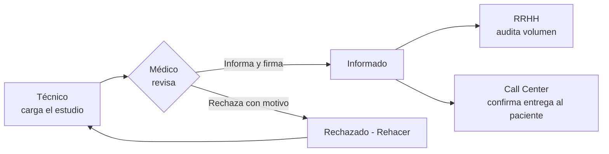

<div align="center">


# ReportFlow

### Plataforma Integrada de Diagnóstico — Hospital Universitario (UNCuyo)

[](https://laravel.com)
[](https://www.php.net)
[](https://www.mysql.com)
[](https://tailwindcss.com)
[](https://alpinejs.dev)
[]()

</div>

---

## 📋 Descripción del proyecto

**ReportFlow** es un sistema web desarrollado para el **Hospital Universitario** que digitaliza y ordena el circuito completo de un estudio médico: desde que un técnico lo carga, pasando por la redacción y firma del informe por parte del médico especialista, hasta la auditoría de Recursos Humanos y la confirmación al paciente de que su informe está listo para retirar.

El proyecto nace como trabajo integrador de un equipo de seis desarrolladores, y evolucionó desde un prototipo estático (HTML/JS) hacia una aplicación Laravel completa, con roles diferenciados, control de acceso, y una identidad visual que respeta el manual de marca oficial de la institución.

## 🎯 El problema que resuelve

Antes de ReportFlow, un mismo informe médico pasaba por distintos profesionales sin un circuito ordenado: informes incompletos, estudios derivados a la especialidad equivocada, pérdida de tiempo buscando información dispersa, demoras en las validaciones y falta de trazabilidad sobre en qué estado se encontraba cada trámite.

ReportFlow ordena ese proceso dándole a cada actor **una vista propia, con exactamente los permisos y la información que necesita** — ni más, ni menos.

## ✨ Características principales

### 🧪 Módulo Técnico
- Carga de nuevos estudios con datos del paciente (nombre, DNI, edad, contacto) y archivos adjuntos (PDF/JPG/PNG).
- Derivación automática a la especialidad y tipo de estudio correspondiente.
- Historial propio de estudios cargados, con su estado actualizado en tiempo real.
- Visualización del motivo cuando un médico rechaza un estudio y lo devuelve para corrección.

### 🩺 Módulo Médico
- Worklist de estudios pendientes de informar, filtrado por especialidad.
- Redacción y firma digital del informe.
- **Ventana de edición de 24 horas**: un informe firmado puede modificarse libremente durante 24hs; pasado ese plazo, solo admite **adendas** (comentarios anexos), preservando la integridad del informe original.
- Flujo de **rechazo ("Rehacer")**: el médico puede devolver un estudio al técnico con un comentario obligatorio explicando qué corregir.

### 📊 Módulo RRHH / Administración
- Panel general con el volumen de estudios por estado (nuevo, informado, rechazado).
- Auditoría por especialidad y por médico: **cantidad de informes realizados**, sin manejo de aranceles ni montos — el sistema audita volumen de trabajo, no liquidaciones.
- Archivo general de informes firmados, navegable por período (mes/año).

### 📞 Módulo Call Center
- Acceso de solo lectura a los informes **ya cerrados** (firmados), buscables por DNI del paciente.
- Acceso a los datos de contacto del paciente y al estado del trámite, **sin visibilidad sobre el contenido clínico** del informe.
- Simulación del aviso de entrega al paciente.

### 🔐 Seguridad y control de acceso
- Autenticación por usuario y contraseña, con roles bien definidos (Técnico, Médico, RRHH, Call Center).
- Middleware de autorización por rol: cada módulo está aislado — un usuario nunca accede a rutas de un rol que no es el suyo, y es redirigido de forma explícita a su propio panel si lo intenta.

## 🏗️ Arquitectura y stack tecnológico

El proyecto sigue el patrón **MVC** provisto por Laravel, con una separación clara de responsabilidades:

| Capa | Tecnología | Uso |
|---|---|---|
| Backend | **PHP 8.5** + **Laravel** | Framework MVC: rutas, controladores, modelos, validaciones, autorización |
| Base de datos | **MySQL 8** | Persistencia relacional (especialidades, estudios, adendas, usuarios) |
| Frontend | **Blade** + **Tailwind CSS** | Vistas del lado del servidor con estilos utilitarios |
| Interactividad | **Alpine.js** | Modales, pestañas y componentes dinámicos sin recargar la página |
| Build tool | **Vite** | Compilación y recarga en caliente de CSS/JS |
| Control de versiones | **Git** + **GitHub** | Desarrollo en ramas por módulo, integradas sobre `dev` |

### Decisiones de diseño destacadas

- **Roles y estados como Enums de PHP** (`RolUsuario`, `EstadoEstudio`), no como strings sueltos en la base — evita errores de tipeo y centraliza el comportamiento (etiquetas, colores de badge) en un solo lugar.
- **Especialidades y tipos de estudio como tablas**, no como valores fijos en código — el hospital puede sumar nuevas especialidades sin necesidad de un despliegue.
- **Middleware de rol dedicado** (`EnsureUserHasRole`), que aísla cada módulo y redirige con un mensaje explícito ante un acceso indebido.
- **Transacciones atómicas** al crear un estudio con sus archivos adjuntos, para que una falla a mitad de camino no deje datos inconsistentes.

## 🎨 Identidad visual

La interfaz respeta estrictamente el manual de marca del Hospital Universitario:

| Color | Uso | Hex |
|---|---|---|
| 🟦 Azul institucional | Color primario (headers, botones principales) | `#003764` |
| ⬜ Gris texto | Texto secundario | `#59595B` |
| 🟨 Dorado | Color de acento (acciones secundarias) | `#C7A36E` |

**Tipografía:** [Montserrat](https://fonts.google.com/specimen/Montserrat), aplicada en toda la interfaz.

## 📁 Estructura del proyecto
```
app/
├── Enums/ # RolUsuario, EstadoEstudio
├── Http/
│ ├── Controllers/ # Auth, Tecnico, Medico, Rrhh, CallCenter
│ ├── Middleware/ # EnsureUserHasRole
│ └── Requests/ # Validaciones (Form Requests)
├── Models/ # User, Estudio, Especialidad, TipoEstudio, ArchivoEstudio, Adenda
└── Services/ # AlmacenamientoEstudioService (lógica de carga transaccional)

database/
├── migrations/ # Esquema completo, incremental
└── seeders/ # Datos de demostración realistas

resources/views/
├── layouts/ # Layout compartido (sidebar + header)
├── components/ # Sidebar y menú de usuario, sensibles al rol
├── auth/ # Login
├── tecnico/ · medico/ · rrhh/ · callcenter/ # Vistas por módulo

routes/
├── web.php # Autenticación + agrupación de módulos por rol
├── tecnico.php · medico.php · rrhh.php · callcenter.php
```

## 🚀 Instalación y puesta en marcha

### Requisitos previos
- PHP 8.2 o superior
- Composer
- Node.js y npm
- MySQL 8

### Pasos

```bash
# 1. Clonar el repositorio
git clone https://github.com/Scomes02/ReportFlow.git
cd ReportFlow

# 2. Instalar dependencias
composer install
npm install

# 3. Configurar el entorno
cp .env.example .env
php artisan key:generate
```

Editá tu `.env` con los datos de tu base de datos local:

```env
DB_CONNECTION=mysql
DB_HOST=127.0.0.1
DB_PORT=3306
DB_DATABASE=reportflow
DB_USERNAME=root
DB_PASSWORD=
```

```bash
# 4. Migrar y sembrar datos de demostración
php artisan migrate --seed

# 5. Compilar assets (dejar corriendo en una terminal)
npm run dev

# 6. Levantar el servidor (en otra terminal)
php artisan serve
```

La aplicación queda disponible en `http://127.0.0.1:8000`.

## 🔑 Roles y credenciales de prueba

El seeder de demostración crea automáticamente un usuario por rol, con contraseña `password` para todos:

| Rol | Email |
|---|---|
| Técnico | `tecnico.prueba@reportflow.local` |
| Médico | `medico@reportflow.local` |
| RRHH / Administración | `rrhh@reportflow.local` |
| Call Center | `callcenter@reportflow.local` |

> Además del médico y técnico principales, el seeder crea 9 médicos y 3 técnicos adicionales, y distribuye alrededor de 80 estudios entre las 8 especialidades del sistema, para que los paneles de RRHH y Call Center tengan datos representativos desde el primer momento.

## 🧩 Flujo del sistema



## 👥 Equipo de desarrollo

- [Daiana Osorio](https://www.linkedin.com/in/daiana-osorio-b0ba042a9/)
- [Florencia Navarro](https://www.linkedin.com/in/florencia-mag-navarro)
- [Luka Garro](https://www.linkedin.com/in/luka-garro-4400b9423/)
- [Santiago Comes](https://www.linkedin.com/in/santiago-comes)
- [Sebastián Gutierrez](https://github.com/MSebastianGutierrez)
- [Victor Hugo Peinado](https://www.linkedin.com/in/victor-peinado1739/)

## 📄 Licencia

Proyecto desarrollado con fines académicos e institucionales para el Hospital Universitario. Uso restringido al equipo de desarrollo y a la institución para la que fue creado.
