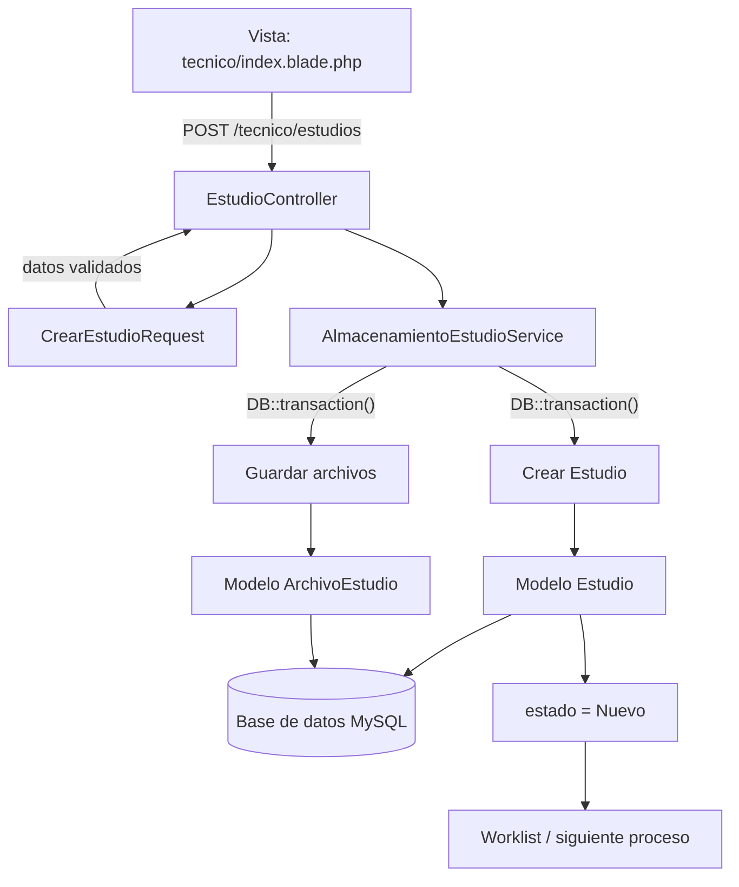
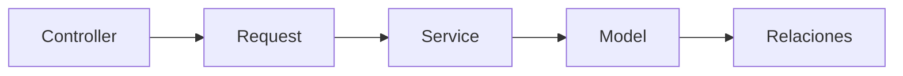

# Flujo de arquitectura — Módulo Técnico (ReportFlow)

> Ubicación en el repo: `docs/arquitectura/flujo-modulo-tecnico.md`

## Objetivo

Este documento describe el recorrido de una solicitud dentro del módulo Técnico de ReportFlow. El flujo comienza cuando un técnico ingresa los datos de un paciente, selecciona el tipo de estudio y adjunta los archivos correspondientes. La información atraviesa las diferentes capas de Laravel hasta quedar persistida en la base de datos, con el estudio disponible en la cola de trabajo (Worklist) para el siguiente proceso del sistema.

---

## Diagrama de flujo





---

## Responsabilidad de cada capa

### 1. Vista
**Ubicación:** `resources/views/tecnico/index.blade.php`

**Responsabilidades:**
- Mostrar los estudios cargados por el técnico autenticado.
- Exponer el formulario para registrar un nuevo estudio.
- Enviar la información como `multipart/form-data` (necesario porque incluye archivos).
- Adjuntar los archivos en formato PDF/JPG/PNG.

### 2. Controller
**Ubicación:** `app/Http/Controllers/Tecnico/EstudioController.php`

**Responsabilidad:** recibir la solicitud HTTP, consultar los estudios del técnico autenticado, delegar la creación al Service, y devolver la respuesta (redirect).

**Qué NO hace:** no maneja archivos directamente, no arma la transacción, no decide el estado inicial. El Controller coordina el flujo, pero no contiene lógica de negocio — eso está bien resuelto en tu implementación.

```php
// app/Http/Controllers/Tecnico/EstudioController.php
class EstudioController extends Controller
{
    public function index()
    {
        $estudios = Estudio::where('tecnico_id', auth()->id())->latest()->get();

        return view('tecnico.index', compact('estudios'));
    }

    public function store(CrearEstudioRequest $request, AlmacenamientoEstudioService $service)
    {
        $service->crear($request->validated(), $request->user());

        return redirect()->route('estudios.index')->with('success', 'Estudio registrado correctamente.');
    }
}
```

### 3. Form Request
**Ubicación:** `app/Http/Requests/Tecnico/CrearEstudioRequest.php`

**Responsabilidad:** validar todos los datos de entrada del formulario — no solo los archivos, sino también los datos del paciente y del estudio. Es la primera línea de defensa: si algo no cumple las reglas, el proceso se corta acá y el Service nunca se entera de que existió un intento inválido.

```php
// app/Http/Requests/Tecnico/CrearEstudioRequest.php
class CrearEstudioRequest extends FormRequest
{
    public function authorize(): bool
    {
        return $this->user()->rol === 'tecnico';
    }

    public function rules(): array
    {
        return [
            'paciente_nombre'   => ['required', 'string', 'max:200'],
            'paciente_dni'      => ['required', 'string', 'max:20'],
            'paciente_edad'     => ['required', 'integer', 'min:0', 'max:120'],
            'especialidad_id'   => ['required', 'exists:especialidades,id'],
            'tipo_estudio_id'   => ['required', 'exists:tipos_estudio,id'],
            'fecha_estudio'     => ['required', 'date'],
            'archivos'          => ['required', 'array', 'min:1'],
            'archivos.*'        => ['file', 'mimes:pdf,jpg,jpeg,png', 'max:20480'],
        ];
    }
}
```

### 4. Service
**Ubicación:** `app/Services/AlmacenamientoEstudioService.php`

**Responsabilidad:** es el corazón del flujo — contiene toda la lógica de negocio del módulo técnico:
- Crear el `Estudio` con el técnico autenticado asignado.
- Definir el estado inicial (`Nuevo`).
- Guardar los archivos en el storage.
- Registrar la metadata de cada archivo (`ArchivoEstudio`).

Todo dentro de una transacción (`DB::transaction()`), para garantizar que el estudio y sus archivos se guarden de forma atómica — si falla el guardado de un archivo, no queda un estudio "huérfano" sin adjuntos.

```php
// app/Services/AlmacenamientoEstudioService.php
class AlmacenamientoEstudioService
{
    public function crear(array $datos, User $tecnico): Estudio
    {
        return DB::transaction(function () use ($datos, $tecnico) {
            $estudio = Estudio::create([
                'paciente_nombre' => $datos['paciente_nombre'],
                'paciente_dni'    => $datos['paciente_dni'],
                'paciente_edad'   => $datos['paciente_edad'],
                'especialidad_id' => $datos['especialidad_id'],
                'tipo_estudio_id' => $datos['tipo_estudio_id'],
                'fecha_estudio'   => $datos['fecha_estudio'],
                'tecnico_id'      => $tecnico->id,
                'estado'          => EstadoEstudio::Nuevo,
            ]);

            foreach ($datos['archivos'] as $archivo) {
                $path = $archivo->store('estudios/' . $estudio->id, 'private');

                $estudio->archivos()->create([
                    'nombre_original' => $archivo->getClientOriginalName(),
                    'path'            => $path,
                    'mime_type'       => $archivo->getMimeType(),
                    'tamanio'         => $archivo->getSize(),
                ]);
            }

            return $estudio;
        });
    }
}
```

> **Punto clave:** `'estado' => EstadoEstudio::Nuevo` es lo que cumple directamente la consigna del módulo técnico — *"inyectar nuevos pacientes/estudios a la cola de trabajo (Worklist) con estado Nuevo"*. Este único campo es el que conecta el trabajo del técnico con el siguiente eslabón del flujo (el médico tomando estudios `Nuevo` desde el worklist).

### 5. Modelos involucrados

**`Estudio`** — representa el estudio solicitado por el técnico.
```php
class Estudio extends Model
{
    protected $casts = ['estado' => EstadoEstudio::class];

    public function tipoEstudio(): BelongsTo
    {
        return $this->belongsTo(TipoEstudio::class);
    }

    public function tecnico(): BelongsTo
    {
        return $this->belongsTo(User::class, 'tecnico_id');
    }

    public function archivos(): HasMany
    {
        return $this->hasMany(ArchivoEstudio::class);
    }
}
```

**`ArchivoEstudio`** — representa cada archivo adjuntado (ubicación física, nombre original, tipo MIME, tamaño).
```php
class ArchivoEstudio extends Model
{
    public function estudio(): BelongsTo
    {
        return $this->belongsTo(Estudio::class);
    }
}
```

### 6. Relaciones principales

| Modelo | Relación |
|---|---|
| `Estudio` | pertenece a `TipoEstudio` |
| `Estudio` | pertenece a `Técnico` (`User`) |
| `Estudio` | tiene muchos `ArchivoEstudio` |
| `TipoEstudio` | pertenece a `Especialidad` |
| `ArchivoEstudio` | pertenece a `Estudio` |

---

## Resumen de responsabilidades

| Capa | Responsabilidad | Lo que NUNCA debe tener |
|---|---|---|
| **Vista** | Formulario y listado del técnico | Lógica de guardado |
| **Controller** | Recibir request, delegar, responder | Reglas de negocio, transacciones |
| **Request** | Validar datos de paciente, estudio y archivos | Lógica de guardado |
| **Service** | Orquestar la transacción: crear Estudio + guardar archivos + fijar estado `Nuevo` | Código HTTP (`request()`, `redirect()`) |
| **Model** | Representar la tabla, exponer relaciones | Lógica de negocio pesada |
| **Relaciones** | Definir cómo se conectan las tablas vía Eloquent | — |

---

## Flujo resumido

```
Técnico
   │
   ▼
Vista Blade
   │
   ▼
EstudioController
   │
   ▼
CrearEstudioRequest
   │
   ▼
AlmacenamientoEstudioService
   │
   ├── Estudio
   │
   └── ArchivoEstudio
          │
          ▼
       MySQL
          │
          ▼
   estado = Nuevo
```

---

## Dónde guardarlo

```
docs/
    arquitectura/
        flujo-modulo-tecnico.md   ← este archivo
        flujo-tecnico.png         ← export opcional (Miro / captura del render de Mermaid)
```
Al estar en formato Mermaid dentro del `.md`, GitHub renderiza los diagramas automáticamente al abrir el archivo en el repo — el PNG es opcional, solo si lo necesitan también para una presentación.
